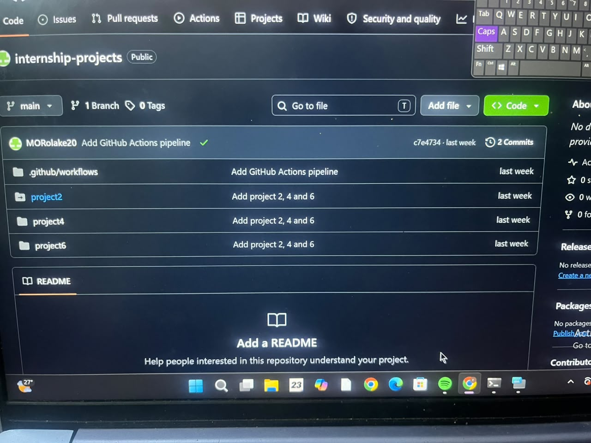
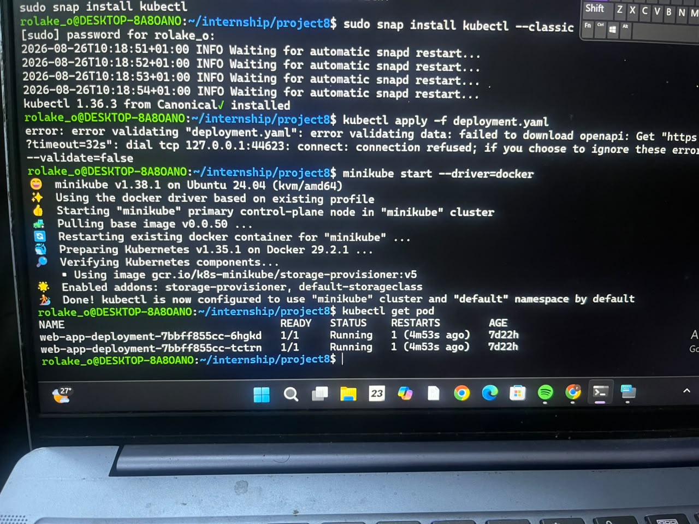
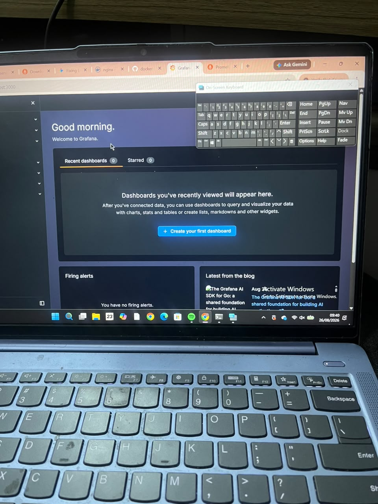

# Cloud Engineering Internship Portfolio

## Overview

This repository contains the projects and practical tasks I completed during
my Cloud Engineering internship. During the internship, I gained practical
experience with Linux, Git and GitHub, Docker, Docker Compose, GitHub Actions,
Kubernetes, Prometheus, and Grafana.

---

## Week 6 — Docker Compose Multi-Container Setup

I deployed a multi-container application using Docker Compose. This helped me
understand how multiple services can run together in a containerized
environment.

### Evidence

---

## Week 7 — GitHub Actions

I worked with GitHub Actions to automate the project workflow. The workflow
completed successfully, as shown by the green checkmark.

### Evidence

---

## Week 8 — Kubernetes Self-Healing

I deployed an application using Kubernetes and tested its self-healing
capability. After deleting a running pod, Kubernetes automatically created a
replacement pod to maintain the required number of replicas.

### Evidence

---

## Week 9 — Prometheus and Grafana

I configured Prometheus and Grafana for monitoring and visualization.
Prometheus collects metrics while Grafana provides dashboards for viewing
the collected metrics.

### Evidence

---

## Technologies Used

- Linux / Ubuntu
- Git and GitHub
- Docker
- Docker Compose
- GitHub Actions
- Kubernetes
- Minikube
- Prometheus
- Grafana
